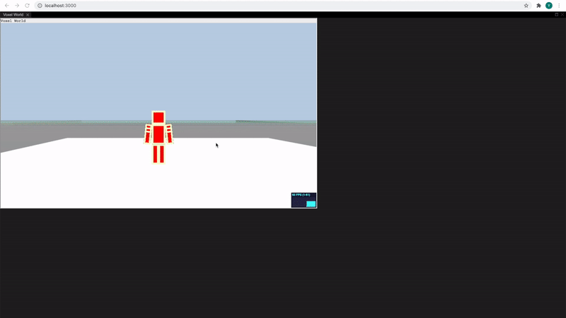

# IGLU Voxel World

  

A customized Voxel World designed for IGLU data collection.

  




# Voxel World versions for turk tasks

1. single-turn HIT

https://cdn.jsdelivr.net/gh/snyxan/myWorld@main/myWorld_freeze.js

2. Non single-turn HIT

https://cdn.jsdelivr.net/gh/snyxan/myWorld@main/myWorld_option_1.js


  

## Know-hows of the app

  

First you need to use browserify to bundle up all the dependencies of VoxelWorld. Note that VoxelWorld is a standalone js file which we compile separately. So make sure you aren't missing this step. 

- Run the following commands under root folder:

```
cd web/src/components/VoxelWorld
npm install
browserify api.js -s myWorld > ../../../public/VoxelWorld/myWorld.js
```

- Then you need to go back to the root folder and run the following commands to install the required packages:

 

```
cd web/src
npm install -g yarn ; yarn upgrade; yarn install
```


- Now to start the app, run: `yarn start` under `web/`.

  
This will run the app in development mode.<br  />

Open [http://localhost:3000](http://localhost:3000) to view it in the browser.

The page will reload if you make edits.You will also see any lint errors in the console. <br  />

For debugging: you can set up the debugger in your IDE (for example [here](https://code.visualstudio.com/docs/nodejs/reactjs-tutorial#_debugging-react)) or use the developer console on your browser (for example: Command + option + J for Chrome on Macbook)

  

## Know-hows of VoxelWorld

  

### Basic control

  

**w/a/s/d**: move forward/left/backward/right

  

**space**: jump

  

**double click space**: enable flying mode

**shift**: Move downwards. When you are in flying mode, keep pressing **shift** until the agent hit the ground. Once the agent hit the ground, flying mode will be turned off.

  

**click**: break block

  

***1/2/3/4/5/6**: place a blue/yellow/green/orange/purple/red block